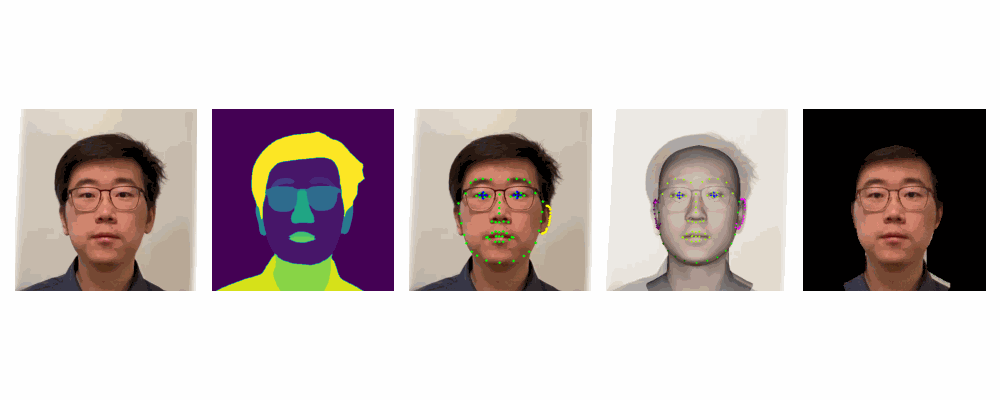
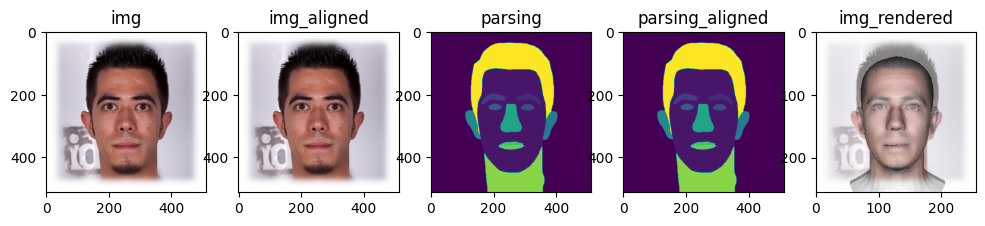
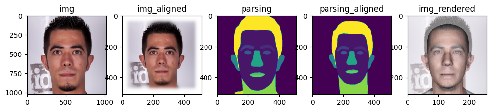

# FLAME Head Tracker

## [](https://opensource.org/licenses/MIT)

- **Author**: Peizhi Yan
- **Date Updated**: 09-28-2024
- **Version**: 1.01

---

<div style="text-align: center;">
        
</div>
(First two example videos were from IMavatar: https://github.com/zhengyuf/IMavatar )


## Table of Contents
- 🔴 [Citation](#-citation)
- 🟢 [Usage](#-usage)
- 🟡 [Environment Setup](#-environment-setup)
- 🔵 [Acknowledgements and Disclaimer](#-acknowledgements-and-disclaimer)


## 🔴 Citation

This code was originally used for "Gaussian Deja-vu" (accepted for WACV 2025 in Round 1). Please consider cite our work if you find this code useful.
```
@misc{yan2025gaussian,
    title={Gaussian Deja-vu: Creating Controllable 3D Gaussian Head-Avatars with Enhanced Generalization and Personalization Abilities},
    author={Yan, Peizhi and Ward, Rabab and Tang, Qiang and Du, Shan},
    note={Accepted at IEEE/CVF Winter Conference on Applications of Computer Vision (WACV) 2025},
    year={2025}
}
```


## 🟢 Usage

[Return to top](#flame-head-tracker)


### Single Image-based Reconstruction

Please follow the example in: ```./Example_single-image-reconstruction.ipynb```

```
from tracker_base import Tracker

tracker_cfg = {
    'mediapipe_face_landmarker_v2_path': './models/face_landmarker_v2_with_blendshapes.task',
    'flame_model_path': './models/FLAME2020/generic_model.pkl',
    'flame_lmk_embedding_path': './models/landmark_embedding.npy',
    'tex_space_path': './models/FLAME_texture.npz',
    'face_parsing_model_path': './utils/face_parsing/79999_iter.pth',
    'uv_coord_mapping_file_path': './models/uv2vert_256.npy',
    'template_mesh_file_path': './models/head_template.obj',
    'result_img_size': 512,
    'device': device,
}

tracker = Tracker(tracker_cfg)

ret_dict = tracker.load_image_and_run(img_path, realign=True)
```

The result ```ret_dict``` contains the following data:
- vertices (5023, 3) : the reconstructed FLAME mesh vertices (including expression)
- shape (1, 100) : the FLAME shape code
- exp (1, 50) : the FLAME expression code
- pose (1, 6) : the FLAME head (first 3 values) and jaw (last 3 values) poses
- tex (1, 50) : the FLAME parametric texture code
- light (1, 9, 3) : the estimated SH lighting coefficients
- cam (6,) : the estimated 6DoF camera pose (yaw, pitch, roll, x, y, z)
- img_rendered : rendered shape on top of original image, for visualization purpose only
- img (512, 512, 3) : the image on which we fit the FLAME model on
- img_aligned (512, 512, 3) : the aligned image
- parsing (512, 512, 3) : the face semantic parsing result of img   
- parsing_aligned (512, 512, 3) : the face semantic parsing result of img_aligned
- lmks_dense (478, 2) : the 478 dense face landmarks from Mediapipe
- lmks_68 (68, 2) : the 68 Dlib format face landmarks
- blendshape_scores (52,) : the facial expression blendshape scores from Mediapipe

**Example Reconstruction Result (realign=True)**:



**Example Reconstruction Result (realign=False)**:




### Video Tracking

Please follow the example in: ```./Example_video-reconstruction.ipynb```

```
from tracker_video import track_video

tracker_cfg = {
    'mediapipe_face_landmarker_v2_path': './models/face_landmarker_v2_with_blendshapes.task',
    'flame_model_path': './models/FLAME2020/generic_model.pkl',
    'flame_lmk_embedding_path': './models/landmark_embedding.npy',
    'tex_space_path': './models/FLAME_texture.npz',
    'face_parsing_model_path': './utils/face_parsing/79999_iter.pth',
    'uv_coord_mapping_file_path': './models/uv2vert_256.npy',
    'template_mesh_file_path': './models/head_template.obj',
    'result_img_size': 512,
    'device': device,
    ## following are used for video tracking
    'original_fps': 60,       # input video fps
    'subsample_fps': 30,      # subsample fps
    'video_path': './assets/IMG_2647.MOV',  # example video
    'save_path': './output',  # tracking result save path
}

## Note that, the first frame will take longer time to process
track_video(tracker_cfg)
```

The results will be saved to the ```save_path```. The reconstruction result of each frame will be saved to the corresponding ```[frame_id].npy``` file. 


## 🟡 Environment Setup

[Return to top](#flame-head-tracker)

### Prerequisites:

- **GPU**: Nvidia GPU with >= 6GB memory (recommend > 8GB). I tested the code on Nvidia A6000 (48GB) GPU.
- **OS**: Ubuntu Linux (tested on 22.04 LTS and 24.04 LTS), I haven't tested the code on Windows.

### Step 1: Create a conda environment. 

```
conda create --name tracker -y python=3.10
conda activate tracker
```

### Step 2: Install necessary libraries.

#### Nvidia CUDA compiler (11.7)

```
conda install -c "nvidia/label/cuda-11.7.1" cuda-toolkit ninja

# (Linux only) ----------
ln -s "$CONDA_PREFIX/lib" "$CONDA_PREFIX/lib64"  # to avoid error "/usr/bin/ld: cannot find -lcudart"

# Install NVCC (optional, if the NVCC is not installed successfully try this)
conda install -c conda-forge cudatoolkit=11.7 cudatoolkit-dev=11.7
```

After install, check NVCC version (should be 11.7):

```
nvcc --version
```

#### PyTorch (2.0 with CUDA)

```
pip install torch==2.0.1 torchvision --index-url https://download.pytorch.org/whl/cu117
```

Now let's test if PyTorch is able to access CUDA device, the result should be ```True```:

```
python -c "import torch; print(torch.cuda.is_available())"
```

#### Some Python packages

```
pip install -r requirements.txt
```

#### Nvidia Differentiable Rasterization: nvdiffrast

**Note that**, we use nvdiffrast version **0.3.1**, other versions may also work but not promised.

```
# Download the nvdiffrast from their official Github repo
git clone https://github.com/NVlabs/nvdiffrast

# Go to the downloaded directory
cd nvdiffrast

# Install the package
pip install .

# Change the directory back
cd ..
```

#### Pytorch3D

**Note that**, we use pytorch3d version **0.7.8**, other versions may also work but not promised.

Installing pytorch3d may take a bit of time.

```
# Download Pytorch3D from their official Github repo
git clone https://github.com/facebookresearch/pytorch3d

# Go to the downloaded directory
cd pytorch3d

# Install the package
pip install .

# Change the directory back
cd ..
```

#### Troubleshoot

Note that the NVCC needs g++ < 12:
```
sudo update-alternatives --install /usr/bin/gcc gcc /usr/bin/gcc-11 50
sudo update-alternatives --install /usr/bin/g++ g++ /usr/bin/g++-11 50
sudo update-alternatives --install /usr/bin/c++ c++ /usr/bin/g++-11 50
```

If there is problem with **nvdiffrast**, check whether it is related to the EGL header file in the error message. If it is, install the EGL Development Libraries (for Ubuntu/Debian-based systems):
```
sudo apt-get update
sudo apt-get install libegl1-mesa-dev
```
Then, uninstall nvdiffrast and reinstall it.


### Step 3: Download some necessary model files.

Because of copyright concerns, we cannot re-share any of the following model files. Please follow the instructions to download the necessary model file.

#### FLAME and DECA

- Download ```FLAME 2020 (fixed mouth, improved expressions, more data)``` from https://flame.is.tue.mpg.de/ and extract to ```./models/FLAME2020```
- Download the files from: https://github.com/yfeng95/DECA/tree/master/data, and place at ```./models/
- Follow https://github.com/TimoBolkart/BFM_to_FLAME to generate the ```FLAME_albedo_from_BFM.npz``` file and place at ```./models/```
- Download ```deca_model.tar``` from https://docs.google.com/uc?export=download&id=1rp8kdyLPvErw2dTmqtjISRVvQLj6Yzje, and place at ```./models/```

#### Mediapipe

- Download ```face_landmarker.task``` from https://storage.googleapis.com/mediapipe-models/face_landmarker/face_landmarker/float16/1/face_landmarker.task, rename as ```face_landmarker_v2_with_blendshapes.task```, and save at ```./models/```


The final structure of ```./models/``` is:

```
./models
    ├── deca_model.tar
    ├── face_landmarker_v2_with_blendshapes.task
    ├── fixed_displacement_256.npy
    ├── FLAME2020
    │   ├── female_model.pkl
    │   ├── generic_model.pkl
    │   ├── male_model.pkl
    │   └── Readme.pdf
    ├── FLAME_albedo_from_BFM.npz
    ├── FLAME_texture.npz
    ├── head_template.obj
    ├── landmark_embedding.npy
    ├── mean_texture.jpg
    ├── placeholder.txt
    ├── texture_data_256.npy
    ├── uv_face_eye_mask.png
    └── uv_face_mask.png
```


## 🔵 Acknowledgements and Disclaimer

[Return to top](#flame-head-tracker)

Our code is mainly based on the following repositories:

- FLAME: https://github.com/soubhiksanyal/FLAME_PyTorch
- Nvdiffrast: https://github.com/NVlabs/nvdiffrast
- Pytorch3D: https://github.com/facebookresearch/pytorch3d
- DECA: https://github.com/yfeng95/DECA
- 3D Gaussian Splatting: https://github.com/graphdeco-inria/gaussian-splatting
- GaussianAvatars: https://shenhanqian.github.io/gaussian-avatars
- FaceParsing: https://github.com/zllrunning/face-parsing.PyTorch

We want to acknowledge the contributions of the authors of these repositories. We do not claim ownership of any code originating from these repositories, and any modifications we have made are solely for our specific use case. All original rights and attributions remain with the respective authors.

**Disclaimer**

Our code can be used for both research and commercial purposes, **provided that the terms of the licenses of any third-party code or dependencies are followed**. We do not assume any responsibility for any issues, damages, or liabilities that may arise from the use of this code. Users are responsible for ensuring compliance with any legal requirements, including licensing terms and conditions, and for verifying that the code is suitable for their intended purposes.

