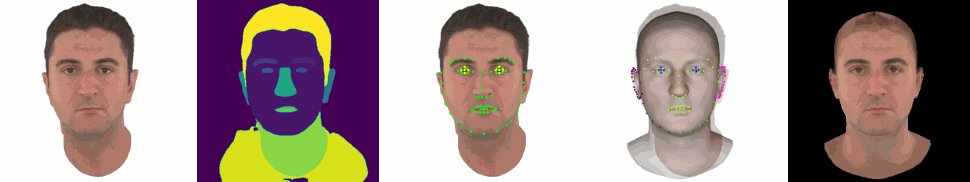

<h1 align="center"><b>FLAME Head Tracker</b></h1>

<div align="center"> 
  <a href="https://opensource.org/licenses/MIT">
    
  </a>
  <br>
  <!-- <span style="font-size:1.0em;">Note: This project depends on other third-party libraries or code, which may be licensed under different terms. When using this project, you are required to comply with the license terms of any dependencies in addition to the MIT License. Please review the licenses of all dependencies before use or distribution.</span> -->
</div>

<div align="center"> 
  <b></b>
  <br>
</div>

> [!NOTE]
> This project depends on other third-party libraries or code, which may be licensed under different terms. When using this project, you are required to comply with the license terms of any dependencies in addition to the MIT License. Please review the licenses of all dependencies before use or distribution.

**Current Version**: v4.1 🍧 (Aug 02, 2025)

> **Update:**
> - Improved tracking speed: 
>   - ~0.9s/frame in landmark-based fitting mode (on Nvidia 4090)
>   - ~1.9s/frame in photometric fitting mode (on Nvidia 4090)
> - Supports optimizable camera FOV.

**Previous Versions**:
- v3.4.1 🍦 (https://github.com/PeizhiYan/flame-head-tracker/tree/v3.4.1)
- v3.3 stable 🍀 (https://github.com/PeizhiYan/flame-head-tracker/tree/v3.3)
- v3.2 stable 🎅 (https://github.com/PeizhiYan/flame-head-tracker/tree/v3.2)

## Supported Features:

| Scenario                        | 🙂 Landmarks-based Fitting  | 🔆 Photometric Fitting  |
|---------------------------------|-----------------------------|--------------------------|
| 📷 Single-Image Reconstruction | ✅  | ✅  |
| 🎥 Monocular Video Tracking    | ✅  | ✅  |


---


## 🦖 Usage

### Single-Image-Based Reconstruction 📷

Please follow the example in: [Example_1_single_image_reconstruction.ipynb](./Example_1_single_image_reconstruction.ipynb)

The result ```ret_dict``` contains the following data:

- **shape** `(1, 300)`  The FLAME shape code.  
- **exp** `(1, 100)`    The FLAME expression code.  
- **head_pose** `(1, 3)`  The FLAME head pose.  Not used (zeros).
- **jaw_pose** `(1, 3)`    The FLAME jaw pose.
- **neck_pose** `(1, 3)`    The FLAME neck pose.   Not used (zeros).
- **eye_pose** `(1, 6)`    The FLAME eyeball poses.  
- **tex** `(1, 50)`    The FLAME parametric texture code.  
- **light** `(1, 9, 3)`    The estimated SH lighting coefficients.  
- **cam** `(1, 6)`    The estimated 6DoF camera pose (yaw, pitch, roll, x, y, z).  
- **fov** `(1)`    The optimized camera FOV.
- **K** `(1, 3, 3)`    The camera intrinsic matrix (assume image size is 256x256).  
- **img_rendered** `(1, 256, 256, 3)`    Rendered shape on top of the original image (for visualization purposes only).  
- **mesh_rendered** `(1, 256, 256, 3)`    Rendered mesh shape with landmarks (for visualization purposes only).  
- **img** `(1, 512, 512, 3)`    The image on which the FLAME model was fit. (If ```realign==True``` ```img``` is identical to ```img_aligned```)  
- **img_aligned** `(1, 512, 512, 3)`    The aligned image.  
- **parsing** `(1, 512, 512)`    The face semantic parsing result of `img`.  
- **parsing_aligned** `(1, 512, 512)`    The face semantic parsing result of `img_aligned`.  
- **lmks_68** `(1, 68, 2)`    The 68 Dlib format face landmarks.
- **lmks_ears** `(1, 20, 2)`    The ear landmarks (only one ear).  
- **lmks_eyes** `(1, 10, 2)`    The eyes landmarks.  
- **blendshape_scores** `(1, 52)`    The facial expression blendshape scores from Mediapipe. 


### Monocular Video-Based Tracking 🎥

Please follow the example in: [Example_2_video_tracking.ipynb](./Example_2_video_tracking.ipynb)


> [!NOTE]
> - The results will be saved to the ```save_path```. The reconstruction result of each frame will be saved to the corresponding ```[frame_id].npz``` file.
> - Although each ```.npz``` file contains the shape coefficients and texture coefficients, they are actually same (canonical shape and texture). The expression coefficients, jaw pose, eye pose, light, and camera pose were optimized on each frame.
> - If ```photometric_fitting``` is ```True```, it will also save the canonical texture map as a ```texture.png``` file.


<div align="left"> 
  <b>More Examples</b> (input videos were from <a href="https://github.com/zhengyuf/IMavatar">IMAvatar</a>, <a href="https://github.com/gafniguy/4D-Facial-Avatars">NeRFace</a>, <a href="https://philgras.github.io/neural_head_avatars/neural_head_avatars.html">NHA</a>)
  <br>
  <span></span>
  <br>
  <span></span>
  <br>
  <span></span>
  <br>
  <span></span>
  <br>
  <span></span>
  <br>
</div>


---


## 🖥️ Environment Setup


### Prerequisites:

- **GPU**: Nvidia GPU (recommend >= 8GB memory). I tested the code on Nvidia A6000 (48GB) GPU.
- **OS**: Ubuntu Linux (tested on 22.04 LTS and 24.04 LTS), I haven't tested the code on Windows.

### 1️⃣ Step 1: Create a conda environment. 

```
conda create --name tracker -y python=3.10
conda activate tracker
```

### 2️⃣ Step 2: Install necessary libraries.

#### Nvidia CUDA compiler (11.7)

```
conda install -c "nvidia/label/cuda-11.7.1" cuda-toolkit ninja

# (Linux only) ----------
ln -s "$CONDA_PREFIX/lib" "$CONDA_PREFIX/lib64"  # to avoid error "/usr/bin/ld: cannot find -lcudart"

# Install NVCC (optional, if the NVCC is not installed successfully try this)
conda install -c conda-forge cudatoolkit=11.7 cudatoolkit-dev=11.7
```

After install, check NVCC version (should be 11.7):

```
nvcc --version
```

#### PyTorch (2.0 with CUDA)

```
pip install torch==2.0.1 torchvision --index-url https://download.pytorch.org/whl/cu117
```

Now let's test if PyTorch is able to access CUDA device, the result should be ```True```:

```
python -c "import torch; print(torch.cuda.is_available())"
```

#### Some Python packages

```
pip install -r requirements.txt
```


### 3️⃣ Step 3: Download necessary model files.

> [!NOTE]
> Because of copyright concerns, we cannot re-share some model files. Please follow the instructions to download the necessary model file.


#### FLAME 

- Download **FLAME 2020 (fixed mouth, improved expressions, more data)** from https://flame.is.tue.mpg.de/ and extract to ```./models/FLAME2020```
    - As an alternative to manually downloading, you can run ```./download_FLAME.sh``` to automatically download and extract the model files.

- Follow https://github.com/TimoBolkart/BFM_to_FLAME to generate the ```FLAME_albedo_from_BFM.npz``` file and place at ```./models/FLAME_albedo_from_BFM.npz```


#### DECA

- Download ```deca_model.tar``` from https://docs.google.com/uc?export=download&id=1rp8kdyLPvErw2dTmqtjISRVvQLj6Yzje, and place at ```./models/deca_model.tar```

- Download the files from: https://github.com/yfeng95/DECA/tree/master/data, and place at ```./models/```


#### MICA

- Download ```mica.tar``` from https://drive.google.com/file/d/1bYsI_spptzyuFmfLYqYkcJA6GZWZViNt, and place at ```./models/mica.tar```


#### Mediapipe Face Landmarker

- Download ```face_landmarker.task``` from https://storage.googleapis.com/mediapipe-models/face_landmarker/face_landmarker/float16/1/face_landmarker.task, rename as ```face_landmarker_v2_with_blendshapes.task```, and save at ```./models/face_landmarker.task```

#### Ear Landmarker (Optional)

If you want to use ear landmarks during the fitting, please download our pre-trained ear landmarker model ```ear_landmarker.pth``` from https://github.com/PeizhiYan/flame-head-tracker/releases/download/resource/ear_landmarker.pth, and save at ```./models/```. 
> [!WARNING]
> The ear landmarker model was trained on the i-Bug ear landmarks dataset, which is for RESEARCH purpose ONLY.


The final structure of ```./models/``` is:

```
./models
    ├── 79999_iter.pth                 <----- face parsing model
    ├── deca_model.tar                 <----- deca model
    ├── ear_landmarker.pth             <----- our ear landmarker model
    ├── face_landmarker.task           <----- mediapipe face landmarker model
    ├── fixed_displacement_256.npy
    ├── FLAME2020                      <----- FLAME 2020 model folder
    │   ├── female_model.pkl
    │   ├── generic_model.pkl
    │   ├── male_model.pkl
    │   └── Readme.pdf
    ├── FLAME_albedo_from_BFM.npz      <----- FLAME texture model from BFM_to_FLAME
    ├── head_template.obj              <----- FLAME head template mesh
    ├── landmark_embedding.npy
    ├── mean_texture.jpg
    ├── mica.tar                       <----- mica model
    ├── placeholder.txt
    ├── texture_data_256.npy
    ├── uv_face_eye_mask.png
    └── uv_face_mask.png
```


## ⚖️ Acknowledgement and Disclaimer

### Acknowledgement

Our code is mainly based on the following repositories:

- FLAME: https://github.com/soubhiksanyal/FLAME_PyTorch
- Pytorch3D: https://github.com/facebookresearch/pytorch3d
- DECA: https://github.com/yfeng95/DECA
- MICA: https://github.com/Zielon/MICA
- FLAME Photometric Fitting: https://github.com/HavenFeng/photometric_optimization
- FaceParsing: https://github.com/zllrunning/face-parsing.PyTorch
- Dlib2Mediapipe: https://github.com/PeizhiYan/Mediapipe_2_Dlib_Landmarks
- Face Alignment: https://github.com/1adrianb/face-alignment
- i-Bug Ears (ear landmarks dataset): https://ibug.doc.ic.ac.uk/resources/ibug-ears/
- Ear Landmark Detection: https://github.com/Dryjelly/Face_Ear_Landmark_Detection
- ArcFace (from InsightFace): https://github.com/deepinsight/insightface
- RobustVideoMatting: https://github.com/PeterL1n/RobustVideoMatting

We want to acknowledge the contributions of the authors of these repositories. We do not claim ownership of any code originating from these repositories, and any modifications we have made are solely for our specific use case. All original rights and attributions remain with the respective authors.

### Disclaimer

Our code can be used for research purposes, **provided that the terms of the licenses of any third-party code, models, or dependencies are followed**. For commercial use, the parts of code we wrote are for free, but please be aware to get permissions from any third-party to use their code, models, or dependencies. We do not assume any responsibility for any issues, damages, or liabilities that may arise from the use of this code. Users are responsible for ensuring compliance with any legal requirements, including licensing terms and conditions, and for verifying that the code is suitable for their intended purposes.


## 🧸 Citation

Please consider citing our works if you find this code useful. This code was originally used for "Gaussian Deja-vu" (accepted for WACV 2025 in Round 1) and "ArchitectHead" (accepted for WACV 2026). 

```bibtex
@misc{Yan_2026_WACV,
    author    = {Yan, Peizhi and Ward, Rabab and Tang, Qiang and Du, Shan},
    title     = {ArchitectHead: Continuous Level of Detail Control for 3D Gaussian Head Avatars},
    year      = {2025},
    note      = {Accepted to WACV 2026}
}
```

```bibtex
@InProceedings{Yan_2025_WACV,
    author    = {Yan, Peizhi and Ward, Rabab and Tang, Qiang and Du, Shan},
    title     = {Gaussian Deja-vu: Creating Controllable 3D Gaussian Head-Avatars with Enhanced Generalization and Personalization Abilities},
    booktitle = {Proceedings of the Winter Conference on Applications of Computer Vision (WACV)},
    month     = {February},
    year      = {2025},
    pages     = {276-286}
}
```


## Star History

<div align="center">
  <a href="https://www.star-history.com/#PeizhiYan/flame-head-tracker&Date">
    
  </a>
</div>
